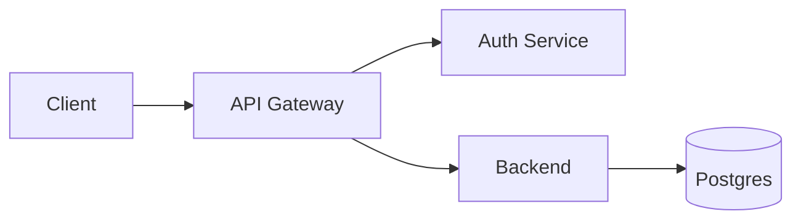

# markdown-writer

LLMs generate Markdown as a 1-D token stream, not a 2-D grid. They cannot
"see" column alignment, count backticks across nested fences, or forecast
whether a single newline will render as a break. This skill exists because
**prompting alone does not fix this** — a deterministic validator does.

## When to use

Activate this skill whenever you are about to:

- Create a new `.md` / `.mdx` / README file.
- Edit existing Markdown in `docs/`, `README.md`, `CHANGELOG.md`, etc.
- Emit Markdown as a string inside another artifact (a code comment block,
  an `ai_generated/` report, a PR body).

Do **not** activate for: source code, JSON, YAML, or config files that merely
end in `.md` but contain no prose (rare).

## The rules

### 1. Hard line breaks

A single `\n` between two text lines collapses into one rendered paragraph.

- To force a visual line break without a new paragraph, end the line with
  **two trailing spaces** (or a backslash `\`).
- To start a new paragraph, use a **blank line** between blocks.

```text
First line.  
Second line rendered below.
```

### 2. Table cell pipe escaping

A literal `|` inside a table cell breaks the column. Escape it as `\|` or
use the HTML entity `&#124;`.

```text
| Regex        | Meaning              |
| ------------ | -------------------- |
| `a\|b`       | matches a or b       |
```

Every row in a table must have the **same cell count** as the header. A
mismatch almost always means an unescaped `|` somewhere.

### 3. Nested code fences

When documenting one fenced block inside another, the **outer fence must use
strictly more fence characters** of the same kind, OR switch fence character
(backticks vs tildes). Count the depth and add one backtick per level.

``````````text
Outer (4 backticks) wrapping inner (3 backticks):

````markdown
```python
x = 1
```
````

Three levels deep: outer uses 5, middle uses 4, inner uses 3.

`````markdown
````markdown
```python
x = 1
```
````
`````
``````````

If you nest same-width same-char fences, the inner one will prematurely close
the outer and the renderer will eat the rest of your document.

### 4. Angle brackets and generics

Bare `<Foo>` in prose is treated as an HTML tag and silently swallowed. Wrap
anything containing `<` or `>` in inline code backticks, or escape as
`&lt;` / `&gt;`.

```text
Use `List<User>` not List<User>.  The latter disappears.
```

### 5. List continuation indentation

Continuation content (paragraph, blockquote, nested list, fenced code) inside
a list item must be indented to the list item's **content start column** —
that is, marker width + 1 space.

For `-`, `*`, `+` lists: marker is 1 char, content starts at column 3, so
continuation needs **2 spaces**. Each nested list level adds 2 more.

```text
- L1.

  Continued paragraph.

  - L2 (2 spaces).

    - L3 (4 spaces).

      - L4 (6 spaces).
```

For ordered lists (`1.`, `10.`), the indent equals digit-count + 2 (e.g. `1.`
→ 3 spaces, `10.` → 4 spaces).

Fenced code blocks inside a list item: indent to the same content column.

````text
- Item.

  ```text
  code here
  ```
````

Indented (non-fenced) code blocks need 4 spaces beyond the content column —
prefer fenced blocks to avoid the extra indent.


### 6. Blockquote continuity

Inside a multi-paragraph blockquote, **every line including blank separators**
must begin with `>`. A blank line without `>` ends the blockquote; if the
next line is `>`, the renderer emits two separate `<blockquote>` elements.

```text
> First paragraph.
>
> Second paragraph, same blockquote.
```

### 7. Underscores and italics

In some Markdown flavors `my_var_name` triggers italics. Always wrap paths,
variable names, and identifiers containing `_`, `*`, or `~` in inline code
backticks: `` `my_var_name` ``.

## Diagrams — the routing decision

You are bad at ASCII alignment because tokenizers collapse runs of spaces.
You are good at Mermaid because it is logical syntax, not spatial layout.
Route based on the diagram's shape.

### Use Mermaid (`mermaid` fence) when:

- The diagram has more than ~5 nodes, branching paths, or feedback loops.
- It is a sequence diagram, state machine, ER diagram, or Gantt chart.
- The target renders in GitHub, GitLab, Obsidian, VS Code preview, or any
  CommonMark + Mermaid viewer.

````text

````

### Use ASCII / Unicode box-drawing when:

- The diagram is a simple linear flow (`[A] --> [B] --> [C]`) under ~5 nodes.
- It represents a **directory tree** (use plain ASCII `├──`, `└──`).
- It will be read in a terminal, a code comment, a man page, or any
  context where Mermaid does not render.
- The user explicitly asks for plain text.

### ASCII execution constraints (when you must draw boxes)

You will miscount columns. So before writing the block, execute these steps
explicitly in your reasoning:

1. Pick a **fixed right-border column** for the block (e.g. column 60).
2. For every line of inner content, compute its visible character length.
   - Box-drawing chars (`│`, `┌`, `─`) count as 1 column each.
   - East-width chars (CJK, emoji) count as 2 — avoid them in diagrams.
3. Pad the right side with `(target_column - text_length)` spaces.
4. Place the closing border char (`│` or `└`) at exactly `target_column`.
5. Re-read the file afterward and confirm every right-border char sits at
   the same column index.

**Never eyeball padding.** Calculate it.

```text
┌──────────────────────────────────┐
│ Aladin Sync Service (Node.js)    │
│ • poll loop (every 15 min)       │
│ • SQLite outbox                  │
└──────────────────────────────────┘
```

## Mandatory validation phase

Single-pass generation is unreliable for spatial and nested syntax. **You
MUST run the deterministic validator after every Markdown write.**

### Invocation

```bash
node .claude/skills/markdown-writer/validate_md.js <path-to-file.md>
```

Optional `--strict` flag promotes warnings (e.g. suspected missing hard line
breaks) to errors.

### Loop

1. Write / edit the Markdown file.
2. Run the validator.
3. If exit code is non-zero, read each reported `path:line: ERROR: ...`,
   patch the offending line with the Edit tool, and re-run.
4. You may only declare the task complete when the validator exits `0`.

The validator enforces:

- Nested code fences: outer count > inner count of same char.
- Table cell-count consistency across header / delimiter / body rows.
- Blockquote continuity: no blank lines without `>` between `>` lines.
- ASCII / Unicode right-border column alignment within each fenced block.
- Unclosed fences.
- Warning: lines that look like intended hard breaks missing trailing
  two spaces (only under `--strict`).

### Limitations

The validator does NOT check: list continuation indentation (4-space rule),
angle-bracket swallowing, underscore italics, or Mermaid syntax. Apply rules
4, 5, and 7 by hand during the write phase. Re-read the rendered file once
before declaring done.

## Output discipline

- Write Markdown to the location the user specified; if unspecified and the
  file is documentation, default to `docs/ai_generated/` per project policy.
- One blank line between block-level elements (paragraphs, lists, tables,
  fences, blockquotes). Two blank lines adds unnecessary vertical space.
- Trailing newline at end of file.
- Prefer ATX headings (`#`, `##`) over Setext (underlines).
- No HTML inside Markdown unless wrapping a `<details>` / `<br>` block.
